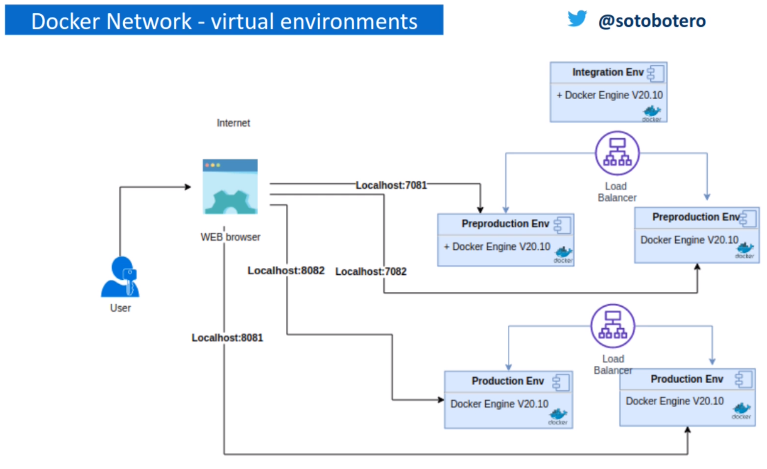

# Docker-compose, orqueestación y escalado

1. [Crear una orquestación compleja con imágenes independientes](#new-orquestations)
2. [Ejecutar, administrar y probar la orquestación](#test-orquestations)
3. [Escalar servicios con docker-compose (múltiples instancias)](#scale)
4. [Redes virtuales en docker y múltiples entornos](#vpn)

<hr>

<a name="new-orquestation"></a>

## 1. Crear una orquestación compleja con imágenes independientes

Descargamos el repositorio con los servicios diferenciados. En este caso tendremos un dockerfile por cada servicio:

- Para la aplicación ángular:

~~~docker
FROM nginx:alpine
 # use a volume is more efficient and speed that filesystem
VOLUME /tmp
RUN rm -rf /usr/share/nginx/html/*
COPY nginx.conf /etc/nginx/nginx.conf
COPY billingApp /usr/share/nginx/html
#expose app and 80 for nginx app
EXPOSE 80
CMD ["nginx", "-g", "daemon off;"]
~~~
> **RUN** se usa básicamente para correr un comando, ya sea instalar un servicio, eliminar ficheros, crear directorios, … Se puede ejecutar las veces que lo necesitemos dentro del dockerfile. **CMD** se utiliza para ejecutar un comando por defecto, cuando se crea el contenedor

- Para el microservicio java:

~~~docker
FROM openjdk:8-jdk-alpine
RUN addgroup -S devopsc && adduser -S javams -G devopsc
USER javams:devopsc
ENV JAVA_OPTS=""
ARG JAR_FILE
ADD ${JAR_FILE} app.jar
 # use a volume is mor efficient and speed that filesystem
VOLUME /tmp
EXPOSE 8080
ENTRYPOINT [ "sh", "-c", "java $JAVA_OPTS -Djava.security.egd=file:/dev/./urandom -jar /app.jar" ]
~~~

> Por seguridad, todos los contenedores deberían tener una configuración de grupo/usuario.

- Para la base de datos, tenemos un script que crea la base de datos por defecto sobre un contenedor de **Postgres** de docker-hub.

~~~sql
#!/bin/bash
set -e

psql -v ON_ERROR_STOP=1 --username "$POSTGRES_USER" --dbname "$POSTGRES_DB" <<-EOSQL
    CREATE USER billingapp WITH PASSWORD 'qwerty';
    CREATE DATABASE billingapp_db;
    GRANT ALL PRIVILEGES ON DATABASE billingapp_db TO billingapp;
EOSQL
~~~

- Por último tenemos  el archivo de configuración *stack-billling.yml* que usaremos en el docker compose con que definimos los cuatro servicios que vamos a utilizar:
  - Postgres
  - Adminer
  - App back
  - App front

~~~yaml
version: '3.1'

services:
#database engine service
  postgres_db:
    container_name: postgres
    image: postgres:latest
    restart: always
    environment:
    ports:
      - 5432:5432
    volumes:
        #allow *.sql, *.sql.gz, or *.sh and is execute only if data directory is empty
      - ./dbfiles:/docker-entrypoint-initdb.d
      - /var/lib/postgres_data:/var/lib/postgresql/data
    environment:
      POSTGRES_USER: postgres
      POSTGRES_PASSWORD: qwerty
      POSTGRES_DB: postgres    
#database admin service
  adminer:
    container_name: adminer
    image: adminer
    restart: always
    depends_on: 
      - postgres_db
    ports:
       - 9090:8080
#Billin app backend service
  billingapp-back:
    build:
      context: ./java
      args:
        - JAR_FILE=*.jar
    container_name: billingApp-back      
    environment:
       - JAVA_OPTS=
         -Xms256M 
         -Xmx256M         
    depends_on:     
      - postgres_db
    ports:
      - 8080:8080 
#Billin app frontend service
  billingapp-front:
    build:
      context: ./angular 
    container_name: billingApp-front
    depends_on:     
      - billingapp-back
    ports:
      - 80:80 
~~~
En este caso para Postgres y Adminer no vamos a utilizar una imagen personalizada, sino que usaremos la imagen que proporciona docker-hub.

En la definción de postgres, en la etiqueta **volumes** indicamos el punto de entrada de la BBDD y establecemos un volumen para poder compartir datos entre la máquina host y el contenedor, de forma que queden persistentes si eliminamos el contenedor.

Para las aplicaciones back y front indicamos en el yaml el docker file desde donde tiene que construir la imagen.

<hr>

<a name="test-orquestation"></a>

## 2. Ejecutar, administrar y probar la orquestación

Ejecutamos el docker compose para construir todas las imágenes del archivo yaml:

~~~
docker-compose -f stack-billing.yml build
~~~

Podemos levantar todas las imágenes necesarias usando el comando:

~~~
docker-compose -f stack-billing.yml up
~~~

Al persistir los datos mediante un volumen, si laramos la ejecución de las imágenes con el comando:

~~~
docker-compose -f stack-billing.yml down (o stop)
~~~

Tras volver a levantarlo, veremos que los datos no se han perdido.

<hr>

<a name="scale"></a>

## 3. Escalar servicios con docker-compose (múltiples instancias)

Vamos a levantar varias instancias del frontal. Primero debemos comentar en el yaml el nombre del contenedor para no provocar conflictos al tener las nuevas instancias el mismo nombre. También debemos modificar el puerto de entrada y aplicar un rango.

~~~yaml
#Billin app frontend service
  billingapp-front:
    build:
      context: ./angular 
    # container_name: billingApp-front
    depends_on:     
      - billingapp-back
    ports:
      - 80-85:80 
~~~

Utilizamos el siguiente comando para levantar las instancias:

~~~
docker-compose -f stack-billing.yml up --scale billingapp-front=3 -d --force-recreate
~~~

El escalado se puede definir en el archivo yaml, permitiendo además limitar recursos en cada réplica. **DEPRECADO**

~~~yaml
#Billin app frontend service
  billingapp-front:
    build:
      context: ./angular
    deploy:
      replicas: 3
      resources:
        limits:
          cpus: "0.15"
          memory: 250M
        reservations:
          cpus: "0.1"
          memory: 128M
    # container_name: billingApp-front
    depends_on:     
      - billingapp-back
    ports:
      - 80-85:80 
~~~

Levantamos las instancias con el comando:

~~~
docker-compose -f stack-billing.yml up -d --force-recreate
~~~

**DEPRECADO** Sólo se va a instanciar una imagen y mostrará un warning indicándolo...

El comando ```docker stats``` muesta las estadísticas de cada uno de los contenedores.

<hr>

<a name="vpn"></a>

## 5. Redes virtuales en docker y múltiples entornos

Podemos tener diferentes redes virtules para separar las aplicaciones o los entornos.



> Debido a que el uso de deploy en el docker-compose está deprecado, sólo crearemos nodo para el front en cada entorno.

La configuración que vamos a tener es de dos entornos (PRE Y PRO, ya que obviaremos dev por ser igaul a lo que hemos realizado hasta ahora) con dos nodos en cada uno de ellos para tener tolerancia a fallo.

En el yml de configuración podemos ver las siguientes modificaciones con respecto a lo que hemos hecho previamente:

Cuando no se establece el atributo networks, todos los servicios definidos se despliegan sobre la misma red virtual. Para este ejemplo vamos a configurar el atributo network para separar los entornos en dos redes virtuales distintas:

~~~yml
networks:
  env_prod:
    driver: bridge  
    #activate ipv6
    driver_opts: 
            com.docker.network.enable_ipv6: "true"
    #IP Adress Manager
    ipam: 
        driver: default
        config:
        - subnet: 172.16.232.0/24
        - subnet: "2001:3974:3979::/64"
  env_prep:   
    driver: bridge  
    #activate ipv6
    driver_opts: 
            com.docker.network.enable_ipv6: "true"
    #IP Adress Manager
    ipam:
        driver: default
        config:
        - subnet: 172.16.235.0/24
        - subnet: "2001:3984:3989::/64"
~~~

A nivel de servicios, debemos clonarlos para tener servicios diferenciados en cada uno de los entornos:

~~~yml
services:
#database engine service
  postgres_db_prod:
    container_name: postgres_prod
    image: postgres:latest
    restart: always
    networks:
      - env_prod      
    environment:
    ports:
      - 5432:5432
    volumes:
        #allow *.sql, *.sql.gz, or *.sh and is execute only if data directory is empty
      - ./dbfiles:/docker-entrypoint-initdb.d
      - /var/lib/postgres_data_prod:/var/lib/postgresql/data
    environment:
      POSTGRES_USER: postgres
      POSTGRES_PASSWORD: qwerty
      POSTGRES_DB: postgres  
#database engine service
  postgres_db_prep:
    container_name: postgres_prep
    image: postgres:latest
    restart: always
    networks:     
      - env_prep
    environment:
    ports:
      - 4432:5432
    volumes:
        #allow *.sql, *.sql.gz, or *.sh and is execute only if data directory is empty
      - ./dbfiles:/docker-entrypoint-initdb.d
      - /var/lib/postgres_data_prep:/var/lib/postgresql/data
    environment:
      POSTGRES_USER: postgres
      POSTGRES_PASSWORD: qwerty
      POSTGRES_DB: postgres    
...
~~~

Debemos tener en cuenta que hemos de cambiar:
- Nombre del servicio
- Nombre del contenedor
- Puertos (cambiar el puerto externo para diferentes entornos, el interno debe ser el mismo)
- Volumen
- Definir a qué red pertenece el servicio

Para el adminer no es necesario replicar el servicio, ya que al ser un gestor de BBDD puedo conectarme al postgres de cada entorno desde la misma instancia. Únicamente hemos de definir que este servicio será común a las dos redes virtuales.

~~~yml
#database admin service
#Use for All enviroments
  adminer:
    container_name: adminer
    image: adminer
    restart: always
    networks:
      - env_prod
      - env_prep
    depends_on: 
      - postgres_db_prod
      - postgres_db_prep   
    ports:
       - 9090:8080
~~~

Para el microservicio en java, además de lo anterior, debemos indicar el jar correspondiente en cada entorno:

~~~yml
#Billin app backend service
  billingapp-back-prod:
    build:
      context: ./java
      args:
        - JAR_FILE=billing-0.0.3-SNAPSHOT.jar
    networks:
      - env_prod     
    container_name: billingApp-back-prod     
    environment:
       - JAVA_OPTS=
         -Xms256M 
         -Xmx256M         
    depends_on:     
      - postgres_db_prod
    ports:
      - 8080:8080 
#Billin app backend service
  billingapp-back-prep:
    build:
      context: ./java
      args:
        - JAR_FILE=billing-0.0.2-SNAPSHOT.jar
    networks:    
      - env_prep
    container_name: billingApp-back-prep      
    environment:
       - JAVA_OPTS=
         -Xms256M 
         -Xmx256M         
    depends_on:     
      - postgres_db_prep
    ports:
      - 7080:7080     
~~~